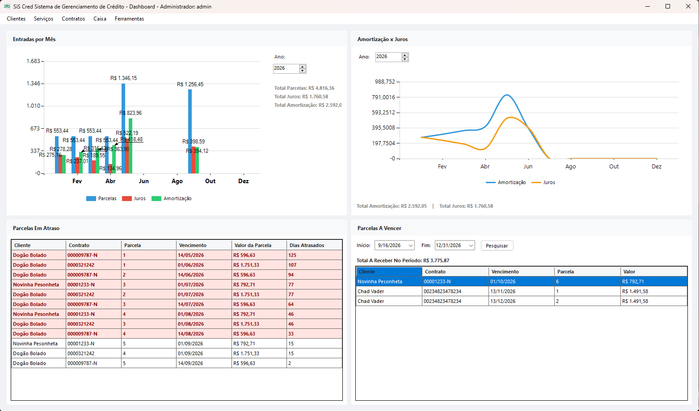
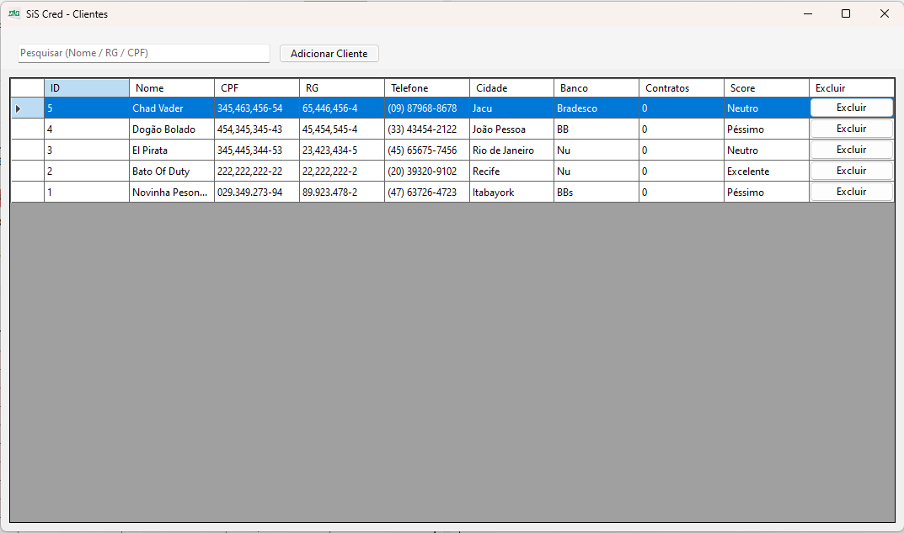
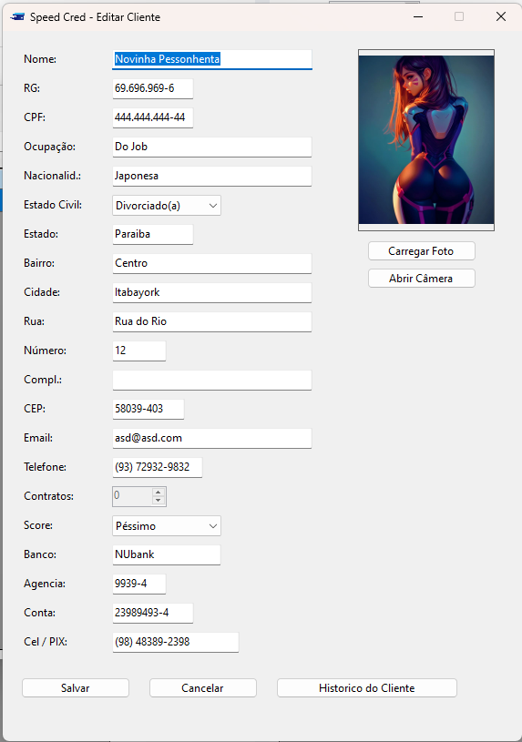
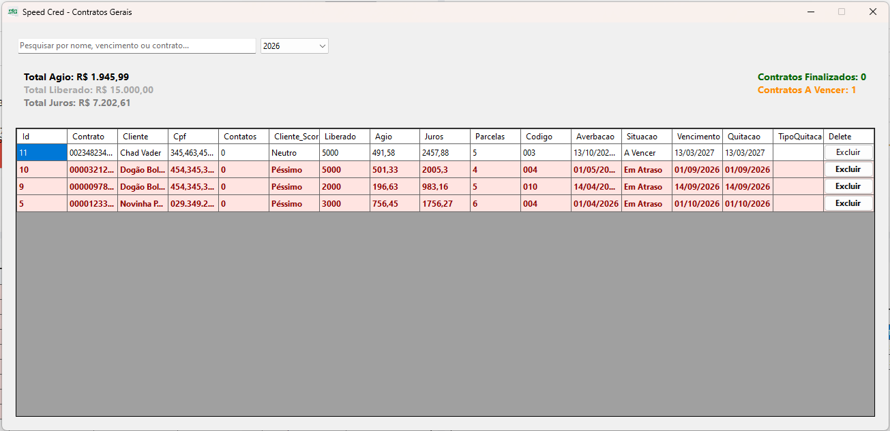
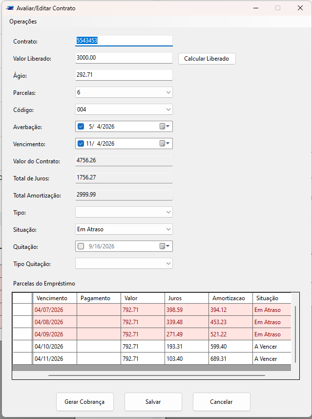
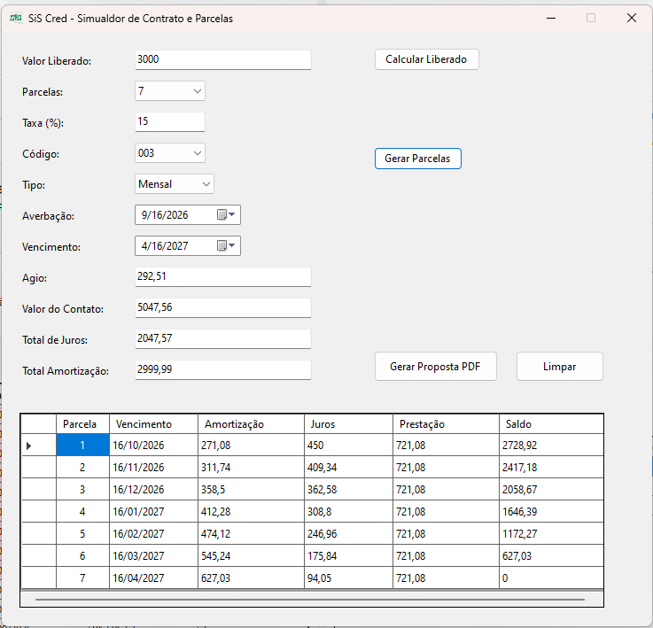
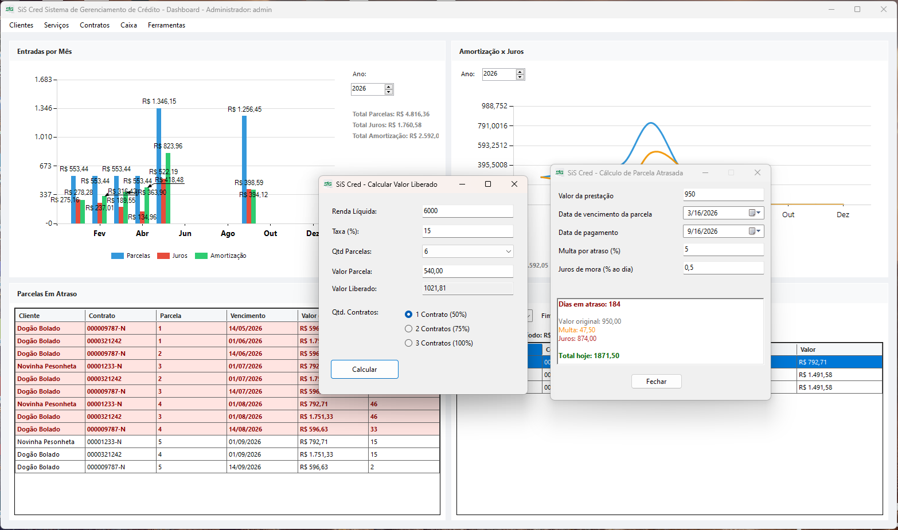
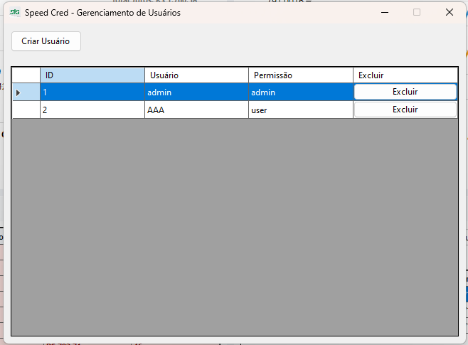

<p align="center">
  
</p>

<p align="center">
  <strong>Sistema de gerenciamento de crédito, empréstimos e controle financeiro</strong>
</p>

<p align="center">
  Aplicação desktop desenvolvida em C# com .NET 8, Windows Forms e SQLite.
</p>

<p align="center">


</p>

---

## Sobre o projeto

O SIS Ced é um sistema desktop desenvolvido para auxiliar no gerenciamento de: clientes, contratos de crédito, empréstimos, parcelas e movimentações financeiras.

O projeto foi desenvolvido com foco em simplicidade, organização e praticidade para operações de crédito, reunindo em uma única aplicação ferramentas para controle de contratos, acompanhamento de pagamentos, cálculos financeiros e geração de documentos.

A aplicação utiliza **SQLite** como banco de dados local, permitindo uma instalação simples e sem a necessidade de configurar um servidor de banco de dados.

---

## Objetivos

O Speed Cred tem como principais objetivos:

- Centralizar o cadastro e gerenciamento de clientes;
- Criar e facilitar o controle de contratos de empréstimos;
- Automatizar a geração e acompanhamento de parcelas e contratos;
- Controlar pagamentos e situações de parcelas;
- Realizar cálculos financeiros;
- Controlar receitas e despesas;
- Gerar simulação e relatórios;
- Facilitar a realização de backups;
- Gerenciar os dados entre dois computadores Off line;
- Disponibilizar uma interface simples para utilização no dia a dia.

---

# Funcionalidades


## Gestão de usuarios

- Cadastro de usuarios;
- Edição de informações cadastrais;
- Pesquisa e localização;
- Cadastro de tipos de usuarios (administrador, usuário);

---

## Gestão de clientes

- Cadastro de clientes;
- Edição de informações cadastrais;
- Pesquisa e localização de clientes;
- Cadastro de informações pessoais;
- Consulta dos contratos associados ao cliente.

---

## Gestão de empréstimos

O sistema permite criar e administrar contratos de empréstimos.

Principais recursos:

- Cadastro de novos contratos;
- Definição do valor do empréstimo;
- Definição da quantidade de parcelas;
- Cálculo das parcelas;
- Controle de juros;
- Controle de amortização;
- Controle de saldo;
- Refinanciamento;
- Quitação antecipada;
- Controle da situação do contrato;
- Edição de contratos existentes.

---

## Gerenciamento de parcelas

Cada contrato possui suas respectivas parcelas, permitindo acompanhar individualmente cada operação.

- Geração automática das parcelas;
- Controle de vencimento;
- Registro de pagamento;
- Controle de saldo;
- Aplicação de juros e multa por atraso;
- Cálculo de antecipação;
- Controle da forma de pagamento.

---

## Cálculos financeiros

O sistema possui recursos para realizar cálculos relacionados às operações de crédito.

Entre eles:

- Juros;
- Amortização;
- Valor da prestação;
- Saldo devedor;
- Multa;
- Juros por atraso;
- Desconto por antecipação;
- Quitação antecipada;
- Refinanciamento.

O cálculo das parcelas utiliza o sistema de amortização **Price**, quando aplicável.

---

# Dashboard (administrador)

O Speed Cred possui um dashboard para visualização dos principais indicadores do sistema.

Entre as informações disponíveis estão:

- Resumo financeiro;
- Empréstimos;
- Valores recebidos;
- Valores em aberto;
- Indicadores por período;
- Gráficos;
- Acompanhamento anual.

O dashboard permite uma visão geral da situação financeira da operação.

---

# Dashboard (usuario)

Entre as informações disponíveis estão:

- Valores recebidos;
- Valores em aberto;
- Indicadores por período;

O dashboard do usuario tem limitações ao uso de todos os recursos do sistema.

---

# Livro Caixa

O módulo **Livro Caixa** permite acompanhar as movimentações financeiras.

É possível consultar informações utilizando filtros de:

- Ano;
- Mês;
- Tipo de movimentação.

Também é possível gerar o relatório em PDF.

---

# Geração de documentos

O sistema possui recursos para geração de documentos relacionados às operações.

### Documentos e relatórios

- Contratos de empréstimo;
- Relatórios financeiros;
- Livro Caixa;
- Documentos relacionados às parcelas.

A geração de documentos utiliza bibliotecas específicas para criação e manipulação de arquivos PDF.

---

# Backup

O sistema possui recursos para realização de backup do banco de dados e de simcronisação de dados.

A funcionalidade tem como objetivo facilitar a preservação das informações e permitir a recuperação dos dados em caso de problemas no computador ou no armazenamento.

> **Recomendação:** mantenha backups periódicos em um local diferente do computador onde o sistema está instalado.

---

# Banco de dados

O Speed Cred utiliza **SQLite** para armazenamento local.

### Principais tabelas

| Tabela | Descrição |
|---|---|
| `clientes` | Dados cadastrais dos clientes |
| `emprestimos` | Contratos de empréstimos |
| `parcelas` | Parcelas vinculadas aos contratos |
| `usuarios` | Usuários do sistema |

---

# Tecnologias

| Tecnologia | Finalidade |
|---|---|
| **C#** | Linguagem principal |
| **.NET 8** | Framework da aplicação |
| **Windows Forms** | Interface desktop |
| **SQLite** | Banco de dados |
| **System.Data.SQLite** | Acesso ao banco |
| **QuestPDF** | Geração de PDFs |
| **PDFsharp / MigraDoc** | Manipulação de documentos |
| **WebView2** | Conteúdo web integrado |
| **AForge** | Recursos de imagem/câmera |
| **Charting** | Gráficos e indicadores |

---

# Requisitos

Para executar o projeto em ambiente de desenvolvimento:

- Windows 10 ou superior;
- [.NET 8 SDK](https://dotnet.microsoft.com/download/dotnet/8.0);
- Visual Studio ou Visual Studio Code;
- Git.

O SQLite é utilizado localmente pela aplicação.

---

# Instalação

## 1. Clonar o repositório

```bash
git clone 
```

## 2. Restaurar os pacotes

```bash
dotnet restore
```

## 3. Compilar

```bash
dotnet build
```

## 4. Executar

```bash
dotnet run
```

## 5. Logar

O sistema assim assim que criar o DB ele cria um administrador (login: admin, password: 123)
---

# Publicação

Para gerar uma versão publicada para Windows:

```bash
dotnet publish -c Release -r win-x64 --self-contained true
```

Os arquivos publicados estarão dentro da pasta:

```text
bin/Release/net8.0-windows/win-x64/publish/
```

---

# Usuários

O sistema possui controle de usuários através de uma tela de login.

A estrutura permite:

- Cadastro de usuários;
- Edição de usuários;
- Autenticação;
- Controle de acesso ao sistema.

---
# ScreenShots

### Dashboard



### Clientes



### Editar Cliente



### Contratos



### Editar Contrato



### Simulador de Contrato



### Outros Simuladores



### Gerenciador de Usuarios



### Livro Caixa


---

# Roadmap

O projeto continua em desenvolvimento.

### Concluído

- [x] Cadastro de clientes
- [x] Cadastro de empréstimos
- [x] Gerenciamento de parcelas
- [x] Cálculo de parcelas
- [x] Controle de pagamentos
- [x] Cálculo de atraso
- [x] Antecipação de parcelas
- [x] Refinanciamento
- [x] Quitação
- [x] Dashboard
- [x] Livro Caixa
- [x] Geração de PDF
- [x] Backup
- [x] Banco de dados SQLite

### Em desenvolvimento / melhorias futuras

- [ ] Backup automático
- [ ] Integração com armazenamento em nuvem
- [ ] Melhorias no sistema de sincronização
- [ ] Novos relatórios financeiros
- [ ] Melhorias na gestão de permissões
- [ ] Melhorias na interface

---

# Observações

O SiS Cred é uma aplicação desktop e atualmente utiliza **SQLite**, sendo indicado principalmente para utilização local.

Para cenários com múltiplos computadores acessando simultaneamente o mesmo banco de dados, recomenda-se avaliar uma arquitetura com banco de dados servidor, como PostgreSQL ou SQL Server.

O executavel está na área de realese aqui do github, junto com seed de backup caso queiram estar as funções sem adicionar clientes.

---

<p align="center">
  <strong>Speed Cred</strong> — Gestão de crédito de forma simples e organizada.
</p>